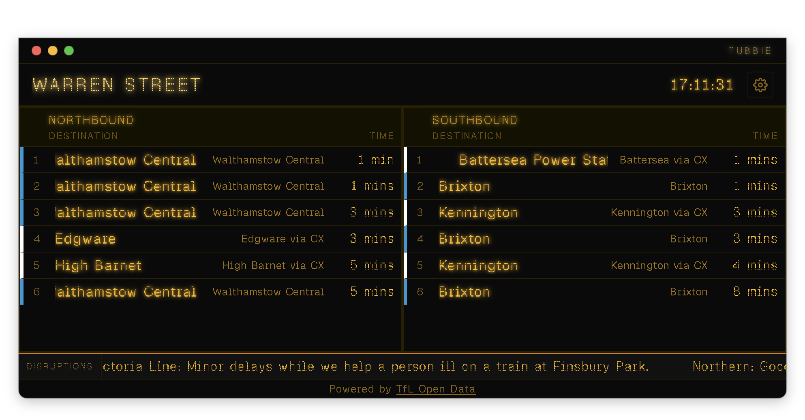

<h1>
  
  Tubbie
</h1>

> A desktop dot-matrix arrivals board for the London Underground, powered by [TfL's Unified API](https://api.tfl.gov.uk). Built with Tauri v2, SvelteKit, and Rust.

[](https://github.com/argen/tubbie/actions/workflows/ci.yml)
[](LICENSE)


<p align="center">
  
</p>

## What it is

Tubbie replicates the classic amber LED dot-matrix boards found on Underground platforms. Pick any tube station, filter by line and direction, and watch real-time arrival predictions scroll in. Four built-in themes — classic amber, classic orange, modern white, and high-contrast — match the visual character of different eras of board hardware.

## Features

- Real-time arrivals for any London Underground station, grouped by platform
- Line and direction filters
- Four visual themes (classic-amber, classic-orange, modern-white, high-contrast)
- Dot-matrix typography with animated row entry, character-reveal, marquee ticker, and "Due" flash
- Settings persisted across restarts via Tauri's secure store
- Anonymous TfL API access by default (50 req/min); optionally supply your own app key
- Stale-data fallback: last-known arrivals shown when offline, with a visible badge

## Requirements

| Requirement | Version |
|---|---|
| macOS | 11 (Big Sur) or later |
| Node.js | 24 (see `web/.nvmrc`) |
| Rust | stable (see `rust-toolchain.toml`) |
| just | 1.x |
| Xcode Command Line Tools | any recent |

Install Rust via [rustup](https://rustup.rs/). Install `just` via `cargo install just` or `brew install just`.

## Install

```sh
git clone git@github.com:argen/tubbie.git
cd tubbie
cd web && npm install && cd ..
```

## Local dev

```sh
just dev
```

Starts the SvelteKit dev server at `http://localhost:5173` and the Tauri shell concurrently. Hot-reload is active for both the frontend and backend.

## Commands

| Command | What it does |
|---|---|
| `just verify` | Full gate: Rust (`fmt`, `clippy`, `test`) + web (`lint`, `format:check`, `typecheck`, `test`) |
| `just build` | Produce a release `.app` bundle at `target/release/bundle/macos/Tubbie.app` |
| `just dev` | Start Tauri dev + Vite dev server concurrently |
| `just verify-live` | Live integration tests against `api.tfl.gov.uk` (not in CI; requires network) |
| `just record-fixtures` | Refresh committed TfL API fixtures from the live API |

## Configuration

User preferences are stored by Tauri in the platform app-data directory:

- **macOS:** `~/Library/Application Support/app.tubbie/`

The `config.json` inside that directory holds the current station, line filters, direction filters, and poll interval. You can inspect it, but editing it manually is not necessary — the Settings screen in the app covers all fields.

### TfL API key (optional)

Anonymous access works out of the box (TfL allows 50 requests/minute without a key). If you plan to poll frequently or share a network with other anonymous callers, register a free key at [api-portal.tfl.gov.uk](https://api-portal.tfl.gov.uk) and enter it in the app's Settings screen. It is stored securely via `tauri-plugin-store` and never committed or logged.

Alternatively, set `TFL_APP_KEY=<key>` in your shell environment before launching.

## Distribution (unsigned builds)

### Download a release

Tagged builds are published to [GitHub Releases](../../releases) as unsigned `.dmg` installers for Apple Silicon. Mount the DMG, drag Tubbie to Applications, and on first launch right-click the app and choose **Open** to bypass Gatekeeper. Alternatively:

```sh
xattr -dr com.apple.quarantine /Applications/Tubbie.app
```

### Build locally

`just build` produces the same unsigned `.app` at `target/release/bundle/macos/Tubbie.app` for development use.

### Cutting a release

Bump `version` in `src-tauri/tauri.conf.json` to match the tag, commit, then push the tag:

```sh
git tag v0.1.0
git push origin v0.1.0
```

The `.github/workflows/release.yml` workflow builds the app on a `macos-14` runner and opens a **draft** release with the `.dmg` attached — review it on GitHub and click **Publish** when ready.

Signed and notarized builds for one-click distribution are tracked as M8 in [`docs/ADR/distribution-roadmap.md`](docs/ADR/distribution-roadmap.md).

## TfL attribution

Powered by [TfL Open Data](https://tfl.gov.uk/info-for/open-data-users/). Contains OS data © Crown copyright and database rights 2016. Collated by TfL. Use of TfL data is governed by the [TfL Open Data Licence](https://tfl.gov.uk/corporate/terms-and-conditions/transport-data-service).

## Licence

MIT — see [`LICENSE`](LICENSE).

## Contributing

See [`docs/README.md`](docs/README.md) for conceptual documentation and [`docs/ADR/README.md`](docs/ADR/README.md) for architectural decisions. All contributions welcome via pull request against `main`.

Before opening a PR, confirm `just verify` is green.
